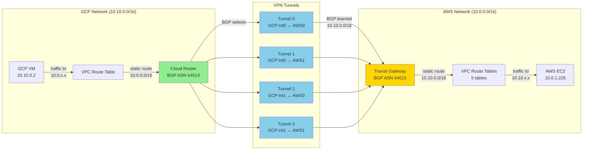

# Multi-Cloud VPN Architecture: GCP ↔ AWS

## Overview

This project establishes a high-availability VPN connection between Google Cloud Platform (GCP) and Amazon Web Services (AWS), enabling secure communication between workloads in both clouds.

```ascii
┌─────────────────────────────────────────┐     ┌─────────────────────────────────────────┐
│  GCP (asia-northeast1)                  │     │  AWS (ap-southeast-1)                   │
│  ┌───────────────────────────────────┐  │     │  ┌───────────────────────────────────┐  │
│  │ VPC: 10.10.0.0/16                 │  │     │  │ VPC: 10.0.0.0/16                  │  │
│  │  ┌─────────────────────────────┐  │  │     │  │  ┌─────────────────────────────┐  │  │
│  │  │ GCP VM: 10.10.0.2           │  │  │     │  │  │ AWS EC2: 10.0.1.226         │  │  │
│  │  │ e2-small, Ubuntu 24.04      │  │  │     │  │  │ t3.micro, Ubuntu 24.04      │  │  │
│  │  └─────────────────────────────┘  │  │     │  │  └─────────────────────────────┘  │  │
│  └───────────────┬───────────────────┘  │     │  └───────────────┬───────────────────┘  │
│                  │                       │     │                  │                       │
│  ┌───────────────▼───────────────────┐  │     │  ┌───────────────▼───────────────────┐  │
│  │ HA VPN Gateway (2 interfaces)    │  │     │  │ Transit Gateway + VPN            │  │
│  │ Cloud Router (BGP ASN: 64514)    │  │     │  │ (BGP ASN: 64515)                 │  │
│  └───────────────┬───────────────────┘  │     │  └───────────────┬───────────────────┘  │
└──────────────────┼─────────────────────┘     └──────────────────┼──────────────────────┘
                   │                                                │
                   └────────────► 🔒 4 IPsec Tunnels ◄─────────────┘
                                  🔄 BGP Dynamic Routing
```

## Infrastructure Components

### Network Overview

| Component | GCP | AWS |
|-----------|-----|-----|
| **Region** | 🌏 Tokyo (asia-northeast1) | 🌏 Singapore (ap-southeast-1) |
| **VPC CIDR** | 10.10.0.0/16 | 10.0.0.0/16 |
| **Subnet** | 10.10.0.0/18 | 10.0.1.0/24 (private) |

### VPN Connection

| Component | GCP | AWS |
|-----------|-----|-----|
| **VPN Gateway** | HA VPN Gateway (2 interfaces) | Transit Gateway |
| **BGP ASN** | 64514 | 64515 |
| **Tunnels** | 4 IPsec tunnels | 4 VPN connections |
| **Route to Remote** | 10.0.0.0/16 → vpn-tunnel-0 | 10.10.0.0/16 → Transit Gateway |

### Virtual Machines

| Component | GCP VM | AWS EC2 |
|-----------|--------|---------|
| **Name** | test-gcp-vm | test-aws-vm |
| **Size** | e2-small (2 vCPU, 2 GB) | t3.micro (1 vCPU, 1 GB) |
| **OS** | Ubuntu 24.04 LTS | Ubuntu 24.04 LTS |
| **Private IP** | 10.10.0.2 | 10.0.1.226 |
| **Public IP** | ❌ None | ✅ 13.250.58.59 |
| **SSH Access** | 🔐 IAP tunnel | 🔑 Direct SSH |

### Security Rules

| GCP Firewall Rules | AWS Security Group |
|-------------------|-------------------|
| ✅ SSH from IAP (35.235.240.0/20) | ✅ SSH from anywhere |
| ✅ All traffic from AWS (10.0.0.0/16) | ✅ All traffic from GCP (10.10.0.0/16) |
| ✅ All internal (10.10.0.0/16) | ✅ All internal (10.0.0.0/16) |


### BGP Configuration

| Parameter | GCP | AWS |
|-----------|-----|-----|
| **ASN** | 64514 (Private ASN) | 64515 (Private ASN) |
| **BGP Peers** | 4 (one per tunnel) | 4 (one per tunnel) |
| **Advertised Routes** | 10.10.0.0/18, 10.10.64.0/18 | Learned via BGP |
| **Learned Routes** | 10.0.0.0/16 (from AWS) | 10.10.0.0/18, 10.10.64.0/18 (from GCP) |
| **BGP Status** | UP (all 4 peers) | UP (all 4 tunnels) |

### Routing

