# Multi-Cloud VPN Architecture: GCP ↔ AWS

## Overview

This project establishes a high-availability VPN connection between Google Cloud Platform (GCP) and Amazon Web Services (AWS), enabling secure communication between workloads in both clouds.

## Infrastructure Components

### Network Overview

| Component | GCP | AWS |
|-----------|-----|-----|
| **Region** | 🌏 Tokyo (asia-northeast1) | 🌏 Singapore (ap-southeast-1) |
| **VPC CIDR** | 10.10.0.0/16 | 10.0.0.0/16 |
| **Subnet** | 10.10.0.0/18 | 10.0.1.0/24 (private) |

### VPN Connection

| Component | GCP | AWS |
|-----------|-----|-----|
| **VPN Gateway** | HA VPN Gateway (2 interfaces) | Transit Gateway |
| **BGP ASN** | 64514 | 64515 |
| **Tunnels** | 4 IPsec tunnels | 4 VPN connections |
| **Route to Remote** | 10.0.0.0/16 → vpn-tunnel-0 | 10.10.0.0/16 → Transit Gateway |

### Virtual Machines

| Component | GCP VM | AWS EC2 |
|-----------|--------|---------|
| **Name** | test-gcp-vm | bastion-vm |
| **Size** | e2-small (2 vCPU, 2 GB) | t3.micro (2 vCPU, 1 GB) |
| **OS** | Ubuntu 24.04 LTS | Ubuntu 24.04 LTS |
| **Private IP** | 10.10.0.x | 10.0.1.x |
| **Public IP** | ❌ None (Cloud NAT) | ❌ None (NAT Gateway) |
| **SSH Access** | 🔐 IAP tunnel | 🔐 EC2 Instance Connect Endpoint |
| **Internet Access** | ✅ Cloud NAT | ✅ NAT Gateway |

### Security Rules

| GCP Firewall Rules | AWS Security Group |
|-------------------|-------------------|
| ✅ SSH from IAP (35.235.240.0/20) | ✅ SSH from EIC Endpoint (dynamic SG) |
| ✅ All traffic from AWS (10.0.0.0/16) | ✅ All traffic from GCP (10.10.0.0/16) |
| ✅ All internal (10.10.0.0/16) | ✅ All internal (10.0.0.0/16) |
| ✅ ICMP from AWS VPC | ✅ ICMP from GCP VPC |

### BGP Configuration

| Parameter | GCP | AWS |
|-----------|-----|-----|
| **ASN** | 64514 (Private ASN) | 64515 (Private ASN) |
| **BGP Peers** | 4 (one per tunnel) | 4 (one per tunnel) |
| **Advertised Routes** | 10.10.0.0/18, 10.10.64.0/18 | Learned via BGP |
| **Learned Routes** | 10.0.0.0/16 (from AWS) | 10.10.0.0/18, 10.10.64.0/18 (from GCP) |
| **BGP Status** | UP (all 4 peers) | UP (all 4 tunnels) |

### Routing

```mermaid
graph LR
    subgraph GCP["GCP Network (10.10.0.0/16)"]
        GVM[GCP VM<br/>10.10.0.2]
        GVPC[VPC Route Table]
        GROUTER[Cloud Router<br/>BGP ASN 64514]
        
        GVM -->|traffic to<br/>10.0.x.x| GVPC
        GVPC -->|static route<br/>10.0.0.0/16| GROUTER
    end
    
    subgraph VPN["VPN Tunnels"]
        T1[Tunnel 0<br/>GCP Int0 ↔ AWS0]
        T2[Tunnel 1<br/>GCP Int0 ↔ AWS1]
        T3[Tunnel 2<br/>GCP Int1 ↔ AWS0]
        T4[Tunnel 3<br/>GCP Int1 ↔ AWS1]
        
        GROUTER -->|BGP selects| T1
        GROUTER --> T2
        GROUTER --> T3
        GROUTER --> T4
    end
    
    subgraph AWS["AWS Network (10.0.0.0/16)"]
        TGW[Transit Gateway<br/>BGP ASN 64515]
        AVPC[VPC Route Tables<br/>5 tables]
        AEC2[AWS EC2<br/>10.0.1.226]
        
        T1 -->|BGP learned<br/>10.10.0.0/18| TGW
        T2 --> TGW
        T3 --> TGW
        T4 --> TGW
        
        TGW -->|static route<br/>10.10.0.0/16| AVPC
        AVPC -->|traffic to<br/>10.10.x.x| AEC2
    end
```



## Deployment Guide

### Prerequisites

1. **GCP**:
   - Service account with necessary permissions
   - `gcloud` CLI configured
   
2. **AWS**:
   - AWS credentials configured (`AWS_PROFILE` or `~/.aws/credentials`)
   - AWS CLI v2.12.0+ (for EC2 Instance Connect)

3. **Terraform**:
   - Terraform v1.0+

### Configuration Files

**Key Configuration: `provision/terraform.tfvars`**

```hcl
# GCP Settings
project_id                  = "your-project-id"
impersonate_service_account = "terraform@your-project.iam.gserviceaccount.com"
gcp_vpc_cidr                = "10.10.0.0/16"
gcp_router_asn              = "64514"

# AWS Settings
aws_vpc_cidr                = "10.0.0.0/16"
aws_router_asn              = "64515"

# Feature Flags
aws_create_vpc_endpoints    = true   # Enable EC2 Instance Connect Endpoint
enable_cloud_nat            = true   # Enable Cloud NAT for GCP

# SSH Keys (unified format)
ssh_public_keys = [
  "username:ssh-ed25519 AAAAC3NzaC1lZDI1NTE5AAAA... user@host"
]

# Optional: Custom private key location
ssh_private_key_file = "../ssh-key/id_ed25519"
```

### Deploy Infrastructure

```bash
# Navigate to provision directory
cd provision

# Set AWS profile (if using named profiles)
export AWS_PROFILE=your-profile

# Initialize Terraform
terraform init

# Review planned changes
terraform plan

# Apply configuration
terraform apply
```

### Verify Deployment

#### 1. Check VPN Tunnels

**GCP:**
```bash
gcloud compute vpn-tunnels list --project=your-project-id
```

**AWS:**
```bash
aws ec2 describe-vpn-connections --region ap-southeast-1
```

#### 2. Test SSH Access

**Connect to GCP VM:**
```bash
gcloud compute ssh test-gcp-vm \
  --zone=asia-northeast1-a \
  --tunnel-through-iap
```

**Connect to AWS EC2:**
```bash
# Get instance ID
INSTANCE_ID=$(terraform output -raw instance_id)

# Using AWS CLI (recommended)
aws ec2-instance-connect ssh \
  --instance-id ${INSTANCE_ID} \
  --connection-type eice

# Using OpenSSH with ProxyCommand
ssh -i ~/.ssh/key.pem \
  -o ProxyCommand='aws ec2-instance-connect open-tunnel --instance-id ${INSTANCE_ID}' \
  ubuntu@10.0.1.x
```

#### 3. Test VPN Connectivity

**From GCP VM to AWS EC2:**
```bash
# SSH into GCP VM
gcloud compute ssh test-gcp-vm --zone=asia-northeast1-a --tunnel-through-iap

# Get AWS EC2 private IP from outputs
# Then ping AWS EC2
ping 10.0.1.x

# SSH to AWS EC2 through VPN
ssh -i ~/.ssh/id_ed25519 ubuntu@10.0.1.x
```

**From AWS EC2 to GCP VM:**
```bash
# SSH into AWS EC2
aws ec2-instance-connect ssh --instance-id $INSTANCE_ID --connection-type eice

# Get GCP VM private IP from outputs
# Then ping GCP VM
ping 10.10.0.x

# SSH to GCP VM through VPN
ssh -i ~/.ssh/id_ed25519 username@10.10.0.x
```

#### 4. Test Internet Access

**GCP VM (via Cloud NAT):**
```bash
# Should work even without public IP
curl -4 https://ifconfig.me
curl https://google.com
```

**AWS EC2 (via NAT Gateway):**
```bash
# Should work even without public IP
curl -4 https://ifconfig.me
curl https://google.com
```

## Terraform Module Structure

```
aws-gcp-vpn/
├── modules/
│   ├── ec2/                      # AWS EC2 module
│   │   ├── init.sh.tpl          # User data template
│   │   ├── main.tf              # EC2 instance
│   │   ├── keypair.tf           # AWS key pair
│   │   ├── security.tf          # Security groups
│   │   ├── vpc_endpoint.tf      # EC2 Instance Connect Endpoint
│   │   ├── variables.tf         # Module variables
│   │   └── outputs.tf           # Module outputs
│   │
│   ├── vm/                       # GCP VM module
│   │   ├── init.sh.tpl          # Startup script template
│   │   ├── main.tf              # Compute instance
│   │   ├── firewall_rules.tf   # Firewall rules
│   │   ├── service_account.tf  # Service account (optional)
│   │   ├── variables.tf         # Module variables
│   │   └── outputs.tf           # Module outputs
│   │
│   ├── network/                  # Network module (both clouds)
│   │   ├── network.tf           # VPCs and subnets
│   │   ├── cloud_nat.tf         # GCP Cloud NAT
│   │   ├── variables.tf         # Module variables
│   │   └── output.tf            # Module outputs
│   │
│   └── gcp-aws-ha-vpn/          # VPN module
│       ├── gcp.tf               # HA VPN Gateway
│       ├── aws.tf               # Transit Gateway + VPN
│       ├── variables.tf         # Module variables
│       └── outputs.tf           # Module outputs
│
├── provision/                    # Root module
│   ├── main.tf                  # Module composition
│   ├── variables.tf             # Root variables
│   ├── outputs.tf               # Root outputs
│   ├── provider.tf              # Provider configuration
│   └── terraform.tfvars         # Variable values
│
├── ssh-key/                      # SSH keys
│   ├── id_ed25519               # Private key
│   └── id_ed25519.pub           # Public key
│
└── scripts/                      # Helper scripts
    ├── test-connectivity.sh     # Test VPN connectivity
    └── ...
```

## Cost Considerations

| Service | GCP Cost | AWS Cost | Notes |
|---------|----------|----------|-------|
| **VPN Gateway** | ~$35/month | ~$36/month | HA VPN (2 tunnels) + Transit Gateway |
| **Cloud NAT** | ~$45/month | ~$45/month | NAT Gateway + data processing |
| **VMs** | ~$15/month | ~$7/month | e2-small vs t3.micro |
| **EIC Endpoint** | N/A | **FREE** ✅ | No charges! |
| **Data Transfer** | Varies | Varies | Intra-region lower cost |
| **Total** | ~$95/month | ~$88/month | Approximate |

**Cost Optimization Tips:**
- ✅ Use smaller VM sizes for testing
- ✅ Delete resources when not in use
- ✅ Use `terraform destroy` to clean up
- ✅ Monitor Cloud NAT usage
- ✅ Consider using Cloud VPN instead of HA VPN for dev/test

## Troubleshooting

### VPN Tunnels Not Establishing

1. **Check BGP Status:**
   ```bash
   # GCP
   gcloud compute routers get-status vpn-router --region=asia-northeast1
   
   # AWS
   aws ec2 describe-vpn-connections --vpn-connection-ids vpn-xxx
   ```

2. **Verify Shared Secret:**
   - Must match on both sides
   - Check `terraform.tfvars`

3. **Check Firewall Rules:**
   - UDP 500 (IKE)
   - UDP 4500 (IPsec NAT-T)
   - ESP Protocol

### Cannot SSH to Instances

**GCP VM:**
- Ensure IAP is enabled
- Check firewall allows IAP range (35.235.240.0/20)
- Verify SSH keys in metadata

**AWS EC2:**
- Ensure EIC Endpoint is created (`aws_create_vpc_endpoints = true`)
- AWS CLI version >= 2.12.0
- Check security group allows SSH from EIC Endpoint SG

### No Internet Access

**GCP VM:**
- Verify `enable_cloud_nat = true`
- Check Cloud NAT is in same region
- Check Cloud NAT logs

**AWS EC2:**
- Verify NAT Gateway exists
- Check route table has route to NAT Gateway
- Check security group allows outbound traffic

### Inter-VM SSH Not Working

1. **Check VPN tunnels are UP**
2. **Verify private key is installed:**
   ```bash
   ls -la ~/.ssh/id_ed25519
   ```
3. **Check permissions:**
   ```bash
   chmod 600 ~/.ssh/id_ed25519
   ```
4. **Test connectivity:**
   ```bash
   ping <remote-private-ip>
   ```

## Security Best Practices

1. **SSH Keys:**
   - ✅ Use Ed25519 keys (more secure than RSA)
   - ✅ Different keys for different environments
   - ✅ Rotate keys regularly
   - ⚠️ Never commit private keys to git

2. **Network Security:**
   - ✅ Use private IPs for VMs
   - ✅ Restrict security groups to minimum required
   - ✅ Enable VPC Flow Logs
   - ✅ Monitor Cloud NAT for anomalies

3. **Access Control:**
   - ✅ Use IAP for GCP (audit all access)
   - ✅ Use EIC Endpoint for AWS (IAM-based)
   - ✅ Implement least privilege
   - ✅ Enable CloudTrail/Cloud Audit Logs

4. **VPN Security:**
   - ✅ Use strong shared secrets (rotate regularly)
   - ✅ Enable BGP authentication
   - ✅ Monitor tunnel status
   - ✅ Use IKEv2 where possible

## References

- [GCP HA VPN Documentation](https://cloud.google.com/network-connectivity/docs/vpn/concepts/overview)
- [AWS Transit Gateway Documentation](https://docs.aws.amazon.com/vpc/latest/tgw/)
- [EC2 Instance Connect Endpoint](https://docs.aws.amazon.com/AWSEC2/latest/UserGuide/ec2-instance-connect-methods.html)
- [GCP Cloud NAT](https://cloud.google.com/nat/docs/overview)
- [Terraform AWS Provider](https://registry.terraform.io/providers/hashicorp/aws/latest/docs)
- [Terraform Google Provider](https://registry.terraform.io/providers/hashicorp/google/latest/docs)
```